# PharmaLink

> An online pharmacy marketplace that connects patients with licensed neighbourhood pharmacies.

**Course:** CSC 2210 - Object Oriented Programming 2  
**Semester:** Summer 2025-2026 &nbsp;&middot;&nbsp; **Section:** R &nbsp;&middot;&nbsp; **Group:**   
**Domain:** Online Pharmacy Marketplace  
**Supervised by:** Dr. Md. Iftekharul Mobin  
**Institution:** American International University-Bangladesh (AIUB), Faculty of Science and Technology, Department of Computer Science

---

## Team Members

| Name | ID | Contribution |
|------|----|--------------|
| Nafiul Islam | 21-45717-3 | Case study, functional requirements, user stories, README assembly |
| Md Arafat Rahman | 22-47910-2 | Database design, normalization, SQL schema diagram, schema.sql, feature queries |
| Muhtasim Mahin | 23-53789-3 | UI navigation diagram, ER diagram, form designs (Super Admin and Admin) |
| Shohidur Raza Sujon | 22-49449-3 | Form designs (Customer), report compilation, proofreading |

---

## Table of Contents

1. [Case Study](#1-case-study)
2. [Functional Requirements](#2-functional-requirements)
3. [User Stories](#3-user-stories)
4. [UI Navigation Diagram](#4-ui-navigation-diagram)
5. [Database Design](#5-database-design)
6. [SQL Queries](#6-sql-queries)
7. [User Interface Design](#7-user-interface-design)
8. [Technology Stack](#8-technology-stack)
9. [How to Run (planned)](#9-how-to-run-planned)
10. [Future Work](#10-future-work)
11. [Report](#11-report)
12. [Work Distribution](#12-work-distribution)

---

## 1. Case Study

Anyone who has bought medicine at short notice in Dhaka knows the routine. A child spikes a fever at eleven at night, and someone goes out on a rickshaw to Mitford or the nearest para shop to find out whether the medicine is even in stock. If it is not, the search starts again at the next shop, with no way to compare prices and no way to confirm the strip is genuine. The pharmacy owner has the mirror problem. He keeps stock in a paper register, does not know which item is running out until a customer asks, and cannot reach a buyer four streets away who has never heard of his shop.

PharmaLink is a Windows desktop application that puts a software platform between those two parties. It owns no medicine; it is the IT company in the middle, as Chaldal sits between grocers and households. Licensed pharmacies list what is on their shelves, patients search every listed pharmacy at once, and the platform takes a commission on each sale.

Three actors work inside the system and each wants something different. The Super Admin is the platform operator. He wants a trustworthy marketplace, so he approves every new pharmacy against its DGDA drug licence number, suspends the ones customers rate badly, maintains the master category list, moderates abusive reviews and watches the commission earned. The Admin is a pharmacy owner such as the proprietor of Mitford Pharma. He wants to sell more without hiring staff, so he lists his medicines with price and stock, is warned when an item falls below its minimum level, runs discount offers, and reads an earnings report telling him what he is owed. The Customer is a patient such as a resident of Mirpur 10. She wants the right medicine at a fair price delivered to her door, so she searches, filters by category, price range and area, reads what other buyers said, pays by bKash or cash on delivery, and rates the pharmacy afterwards.

The entities are few and clear. A user is identified by a user id and carries a full name, a unique email, a hashed password, a phone number, a user type that decides which dashboard opens after login, and an account status. A pharmacy is identified by a pharmacy id and holds a shop name, a unique drug licence number, an area such as Mitford or Dhanmondi, a commission rate and an approval status. A medicine is identified by a medicine id and holds a brand name, a generic name, a manufacturer, a strength, a unit price, current stock, a minimum stock level, a prescription required flag and an expiry date.

The relationships are what make the system worth building. One user owns exactly one pharmacy, one pharmacy lists many medicines, and one category classifies many medicines. One customer places many orders, and one order contains many medicines while one medicine appears in many orders, so that many to many relationship is resolved through the OrderItems junction table. One customer writes many reviews, and each review points back to the order that proves the purchase was real.

Money flows in one direction and the commission comes out of the middle of it. The customer pays the full bill at checkout. The order stores the total amount and, beside it, the commission calculated from that pharmacy's own rate, eight percent for most shops and ten for a few. PharmaLink settles the remainder to the owner. Because the commission is frozen on the order row, raising prices next month cannot change what a pharmacy owes on last month's sales.

---

## 2. Functional Requirements

### 2.1 Super Admin

| No. | Requirement |
|---|-------------|
| **1** | The Super Admin shall log in with the same login form as every other user and be routed to the Super Admin dashboard when UserType = 'SuperAdmin'. |
| **2** | The Super Admin shall view every pharmacy registration that is in Pending status and approve or reject it after checking the DGDA licence number. |
| **3** | The Super Admin shall suspend or delete a pharmacy owner, especially one whose average customer rating is poor. |
| **4** | The Super Admin shall view a list of all Admins and Customers with a keyword search and a status filter. |
| **5** | The Super Admin shall view a platform wide sales dashboard showing total orders, total revenue and commission earned per pharmacy. |
| **6** | The Super Admin shall generate a low rated pharmacy report listing every pharmacy whose average rating is below 2.5. |
| **7** | The Super Admin shall add, edit and deactivate entries in the master medicine category list. |
| **8** | The Super Admin shall hide abusive or fake reviews without deleting the underlying row. |
| **9** | The Super Admin shall set the commission rate of an individual pharmacy between 0 and 30 percent. |

### 2.2 Admin (Pharmacy Owner)

| No. | Requirement |
|---|-------------|
| **10** | The Admin shall register a pharmacy with a shop name, DGDA licence number, area, address, contact number and logo, and the pharmacy shall stay Pending until the Super Admin approves it. |
| **11** | The Admin shall create, view, update and delete medicines belonging only to his own pharmacy, through a DataGridView. |
| **12** | The Admin shall view a stock dashboard showing units sold, units remaining and a low stock alert for every medicine where Stock is less than MinStock. |
| **13** | The Admin shall generate a sales and earnings report showing who bought what, on which date and time, at what unit price, with gross sales, platform commission and net earnings. |
| **14** | The Admin shall create percentage discount offers on his own medicines with a start date and an end date. |
| **15** | The Admin shall read the ratings and reviews written on his own medicines but shall not be able to edit or delete them. |
| **16** | The Admin shall verify or reject a prescription image uploaded against an order that contains a prescription only medicine. |
| **17** | The Admin shall update his own profile information and change his own password. |
| **18** | The system shall filter every Admin side query by the logged in owner's PharmacyId so that no pharmacy can read another pharmacy's data. |

### 2.3 Customer

| No. | Requirement |
|---|-------------|
| **19** | The Customer shall sign up with a full name, unique email, unique mobile number, address and password, and shall sign in through the shared login form. |
| **20** | The Customer shall browse medicines listed by every approved pharmacy on one screen. |
| **21** | The Customer shall search medicines by brand name, generic name or manufacturer. |
| **22** | The Customer shall narrow the result set using at least three ComboBox filters: category, price range, area, pharmacy and availability. |
| **23** | The Customer shall open a medicine details screen showing the manufacturer, strength, expiry date, selling pharmacy, prescription requirement and all visible reviews. |
| **24** | The Customer shall add a medicine to the cart, change the quantity of a cart line and remove a cart line. |
| **25** | The Customer shall check out by entering a delivery address and choosing bKash, Nagad, card or cash on delivery, which generates a printable invoice. |
| **26** | The Customer shall upload a photograph of a doctor's prescription when the cart contains a medicine whose RequiresRx flag is set. |
| **27** | The Customer shall view a history of past orders with the invoice of each one. |
| **28** | The Customer shall give a rating from 1 to 5 with a written comment, once per medicine per delivered order. |
| **29** | The Customer shall view all discount offers that are active today with the discounted price already calculated. |
| **30** | The Customer shall update her own profile and change her own password. |

### 2.4 Traceability

Every requirement above is answered by a form in the navigation diagram and by at least one statement in `database/schema.sql`. No requirement is left without a screen, and no screen is left without a query.

| No. | Form | Query | No. | Form | Query |
|------|------|-------|------|------|-------|
| **1** | LoginForm | 5.1 | **16** | VerifyPrescriptionForm | 5.18 |
| **2** | SuperAdminManageShopsForm | 5.11 | **17** | AdminProfileForm | 5.18 |
| **3** | SuperAdminManageShopsForm | 5.11 | **18** | every Admin form | 5.7, 5.8, 5.15 |
| **4** | SuperAdminManageUsersForm | 5.16 | **19** | SignUpForm, LoginForm | 5.14, 5.1 |
| **5** | SuperAdminSalesReportForm | 5.7, 5.13 | **20** | CustomerHomeForm | 5.2, 5.3 |
| **6** | SuperAdminLowRatedShopsForm | 5.10 | **21** | shared search box | 5.4 |
| **7** | ManageCategoriesForm | 5.16 | **22** | CustomerHomeForm | 5.2, 5.3 |
| **8** | ModerateReviewsForm | 5.16 | **23** | MedicineDetailsForm | 5.9 |
| **9** | SuperAdminManageShopsForm | 5.16 | **24** | CartForm | 5.5 |
| **10** | SignUpForm, PharmacyProfileForm | 5.14 | **25** | CheckoutForm, InvoiceForm | 5.6 |
| **11** | AdminMedicineForm, Add / Edit Medicine | 5.15 | **26** | UploadPrescriptionForm | 5.18 |
| **12** | AdminInventoryForm | 5.8 | **27** | OrderHistoryForm | 5.17 |
| **13** | AdminEarningsForm | 5.7 | **28** | GiveRatingForm | 5.17 |
| **14** | DiscountOffersForm | 5.15 | **29** | CustomerOffersForm | 5.12 |
| **15** | AdminReviewsForm | 5.9 | **30** | MyProfileForm | 5.18 |

---

## 3. User Stories

Every feature of every role is written in the required shape, with the form, the inputs, the validation rules and the database effect spelled out underneath.

### 3.1 Super Admin

**1.** *As a Super Admin, I can sign in through the same login form as everyone else, so that the platform has one entry point and one place where access is decided.*

> No separate login for administrator in the system. The email and password fields, which are provided in the `LoginForm`, are used by the Super Admin as well. The user enters their email address and password and a query is sent to the database to verify the user's email and password and to return their `UserType` and account `Status`. The system automatically redirects the user to the right interface, depending on the returned `UserType`, like the Super Admin dashboard, pharmacy dashboard or the customer home page. During the process of logging into the system, the account status is also checked. If the account status is `Pending` or `Suspended`, it will refuse the login request via the predicate of the WHERE clause of the query. So even if an administrator is suspended and enters the correct email and password, he/she can not access the system.

**2.** *As a Super Admin, I can search the full user list, so that I can find an account when a customer or an owner contacts support.*

> All of the Customer accounts and Admin accounts are listed together in the Manage Users section in a DataGridView. The name of the pharmacy is also included as a name for the pharmacy (as pharmacy owner), using a `LEFT JOIN` between the Pharmacies table and the current table. The free text search box allows users to enter a name or email for searching. Filtering by accounts through a Status ComboBox is also provided. The filters are both optional, so if either is left blank, no zero results are returned, rather it indicates that the name or email filter is not applied. Clicking the Suspend button on the User Selection & Status Updater screen performs the same status update as is performed in the Manage Pharmacies screen. This helps to ensure that as long as the application is suspended, it follows the same rule.

**3.** *As a Super Admin, I can change one pharmacy's commission rate, so that I can offer a better rate to a high volume shop without touching anyone else.*

> The rate is a column on Pharmacies rather than a constant in the code, and it is edited from the Manage Pharmacies form. The value must be between 0 and 30, which is enforced by the form and again by a CHECK constraint. Changing it affects only orders placed from that moment on, because every order stores its own CommissionAmount at checkout time, so last month's settlement is never rewritten by today's decision.

**4.** *As a Super Admin, I can approve or reject a new pharmacy registration, so that only pharmacies with a valid drug licence can sell on the platform.*

> The Super Admin opens Manage Pharmacies from the left menu. A DataGridView lists every pharmacy with its owner, licence number, area and status, and a Status ComboBox filters the grid down to Pending. Selecting a row enables the Approve and Reject buttons; with no row selected both stay disabled. Approve runs an UPDATE that sets Pharmacies.Status to 'Approved' and Users.Status to 'Active', after which the owner can log in and the pharmacy's medicines become visible to customers.

**5.** *As a Super Admin, I can suspend a pharmacy owner, so that a shop with repeated complaints stops receiving new orders.*

> The Super Admin selects a pharmacy row and clicks Suspend. A modal confirmation dialog opens showing the pharmacy name and its average rating, because suspension is not reversible from the customer's point of view within the same session. On Yes, three UPDATE statements run inside one transaction: Pharmacies.Status becomes 'Suspended', Users.Status becomes 'Suspended', and every row in Medicines belonging to that pharmacy has IsActive set to 0. Past orders are never deleted, so the sales history and the invoices customers already hold stay valid.

**6.** *As a Super Admin, I can see which pharmacies are rated below 2.5, so that I can act on poor service before customers leave the platform.*

> The Low-Rated Pharmacies form runs a single query that joins Pharmacies, Medicines and Reviews, groups by pharmacy and applies HAVING AVG(Rating) < 2.5 AND COUNT(ReviewId) >= 2, so that one angry review cannot condemn a shop. The grid shows the pharmacy, owner, area, review count and average rating, with rows tinted red. Double clicking a row opens that pharmacy in the Manage Pharmacies form with the record already selected.

**7.** *As a Super Admin, I can view total revenue and commission per pharmacy, so that I know what the platform has earned and what it owes.*

> The Platform Sales Report form takes a date range, an area and an order status through ComboBox and DateTimePicker controls. Generate runs a query that joins Pharmacies, Orders and OrderItems, groups by pharmacy and returns order count, units sold, gross sales, commission and average item price, with a bold total row appended in the DataGridView. Export CSV writes the same result set to a file so it can be reconciled against bank settlements.

**8.** *As a Super Admin, I can hide an abusive review, so that the review section stays useful without destroying the audit trail.*

> The Moderate Reviews form defaults its Rating filter to one and two star reviews, which is where abuse usually sits. The grid shows the reviewer, medicine, pharmacy, comment, date and the order id that proves the purchase. Hide Review sets Reviews.IsHidden to 1 rather than deleting the row, so the review disappears from the customer screens and from the average rating calculation, but remains available if the pharmacy disputes the decision.

**9.** *As a Super Admin, I can maintain the master category list, so that every pharmacy classifies its medicines the same way.*

> The Manage Categories form is a simple DataGridView with Add, Edit and Deactivate buttons. Category name is validated as non empty and is protected by a UNIQUE constraint, so a second 'Antibiotic' row is rejected with a red error label instead of a database exception. A category that is already referenced by a medicine cannot be deleted; it can only be deactivated by setting IsActive to 0, which keeps existing foreign keys valid.

### 3.2 Admin (Pharmacy Owner)

**10.** *As a Pharmacy Owner, I can register my pharmacy and wait for approval, so that customers can trust that every shop on the platform holds a real drug licence.*

> The Sign Up form, with Register as set to Pharmacy Owner, asks for the shop name, DGDA licence number, area, address and contact number in addition to the personal fields. On save two rows are written inside one transaction, a Users row with UserType 'Admin' and Status 'Pending' and a Pharmacies row with Status 'Pending' linked to it. The licence number is protected by a UNIQUE constraint, so the same licence cannot be registered twice. Until the Super Admin approves the application the owner cannot log in and none of his medicines are visible to customers.

**11.** *As a Pharmacy Owner, I can update my shop profile and my password, so that customers always see my current address and my account stays secure.*

> The My Pharmacy Profile form edits the shop name, area, address, contact number and logo, and every UPDATE carries WHERE PharmacyId = @PharmacyId so an owner cannot edit another shop. The licence number is displayed read only, because changing it would mean a new licence and a fresh approval. The Change Password panel asks for the current password, a new one of at least six characters containing a digit, and a confirmation; the update succeeds only if the stored hash matches the current password, so a wrong entry simply updates no rows and the form reports failure.

**12.** *As a Pharmacy Owner, I can add a new medicine, so that customers can find and buy it from my pharmacy.*

> The owner clicks Add Medicine on the Medicines form and a modal dialog opens asking for medicine name, generic name, category (ComboBox), manufacturer, strength, unit price, stock, minimum stock, expiry date, a prescription required checkbox and a description. Unit price must be a positive number, stock and minimum stock must be zero or more, expiry date must be in the future and the name cannot be empty; if any rule fails a red error label appears under the field and the Save button stays disabled. On Save a row is inserted into Medicines carrying the logged in owner's PharmacyId, the same rules are enforced again by CHECK constraints in the database, and the DataGridView refreshes immediately.

**13.** *As a Pharmacy Owner, I can see which of my medicines are running out, so that I can restock before I lose a sale.*

> The Stock and Inventory form opens with four summary tiles and a Low Stock Alert panel. The alert grid runs a query filtered by WHERE PharmacyId = @PharmacyId AND Stock < MinStock, and it displays the shortfall in units so the owner knows how much to order. Rows in the alert panel are painted with a red background through the DataGridView CellFormatting event. Selecting a row and clicking Restock opens the Edit Medicine dialog with the stock field focused.

**14.** *As a Pharmacy Owner, I can read my earnings report, so that I can check what PharmaLink owes me after commission.*

> The Sales and Earnings form takes a date range and an optional medicine filter. It joins Orders, OrderItems, Medicines and Users so that every line shows the order number, date and time, customer name, medicine, quantity, unit price and subtotal. Four tiles above the grid show gross sales, platform commission, net earnings and units sold. Commission is read from Orders.CommissionAmount, which was frozen at checkout time, so changing a medicine's price today never rewrites last month's report.

**15.** *As a Pharmacy Owner, I can create a discount offer, so that I can move stock during a slow season.*

> The Discount Offers form lists the owner's existing offers and lets him create a new one by choosing a medicine from a ComboBox, entering a discount percentage and picking a start and end date. The percentage must be greater than 0 and no more than 70, and the end date cannot be earlier than the start date; both rules are enforced in the form and again by CHECK constraints on the Offers table. Once saved, the discounted price appears automatically on the customer's Offers screen for exactly the dates chosen.

**16.** *As a Pharmacy Owner, I can read the reviews written about my medicines, so that I can understand what customers complain about.*

> The Customer Reviews form is read only by design. It shows a DataGridView of reviewer name, medicine, rating, comment and date for medicines belonging to this pharmacy only, with an average rating displayed above the grid. There is no Delete button anywhere on this form. If the owner believes a review is abusive he uses the Report button, which flags the review for the Super Admin rather than removing it himself.

**17.** *As a Pharmacy Owner, I can verify a prescription before dispatch, so that I do not dispense a controlled medicine without a doctor's order.*

> When an order contains a medicine whose RequiresRx flag is set, the order appears in the Prescriptions queue with the uploaded image and the doctor's name. The owner opens the image, then clicks Approve or Reject, which sets Prescriptions.VerifyStatus. An order whose prescription is still Pending cannot be moved to Confirmed, so the Confirm button on that order stays disabled and a hint explains why.

### 3.3 Customer

**18.** *As a Customer, I can look back at my past orders, so that I can reorder the same medicine and show a bill if something is wrong.*

> Order History lists every order with its date, the selling pharmacy, the number of line items, the total paid, the payment method and a status pill, filtered by status, pharmacy and date range through three ComboBox controls. View Invoice reopens the printable bill for the selected order. Because an order that spans two pharmacies was split at checkout, each pharmacy's delivery appears as its own row with its own invoice, which is what the customer actually received.

**19.** *As a Customer, I can create an account, so that I can order medicine without visiting a pharmacy in person.*

> The Sign Up form asks for account type, full name, email, mobile number, address, password and password confirmation. Email must match a basic address pattern and must not already exist, mobile must be eleven digits and unique, and the two password boxes must match; each failure shows a red label directly under the offending field and keeps the Create Account button disabled. On success a row is inserted into Users with UserType 'Customer' and Status 'Active', while a pharmacy owner signing up is inserted with Status 'Pending' and must wait for Super Admin approval.

**20.** *As a Customer, I can search and filter medicines, so that I can find what I need at a price I can afford.*

> The Home screen carries a search TextBox and five ComboBox filters: category, price range, area, pharmacy and availability. Search matches the keyword against medicine name, generic name and manufacturer with a LIKE query, so typing 'paracetamol' finds Napa and Ace Plus even though neither brand contains that word. Filters are combined in a single query and only medicines belonging to Approved pharmacies are returned. The result count and the number of active filters are shown in the status strip.

**21.** *As a Customer, I can read reviews before I buy, so that I can avoid a pharmacy that sends damaged goods.*

> The Medicine Details screen shows the manufacturer, strength, expiry date, selling pharmacy and whether a prescription is needed, followed by a grid of every visible review with the reviewer's name, star rating, comment and date. The reviews come from a join of Reviews and Users filtered by IsHidden = 0. If a discount offer is running today the original price is struck through and the discounted price is displayed beside it.

**22.** *As a Customer, I can manage my cart, so that I can change my mind before paying.*

> The Cart form lists each line with the medicine, selling pharmacy, unit price, a quantity spinner and a subtotal, plus a summary panel showing items total, discount, delivery charge and the payable amount. Increasing a quantity above the available stock is refused with a message, and reducing quantity to zero removes the line. Adding a medicine that is already in the cart updates the existing row instead of creating a duplicate, which the UNIQUE constraint on (CustomerId, MedicineId) guarantees.

**23.** *As a Customer, I can check out and receive an invoice, so that I have proof of what I paid.*

> The Checkout form pre fills the delivery address from the profile and asks the customer to pick a payment method; choosing bKash or Nagad reveals a mobile number field that must be eleven digits, and the Confirm Order button stays disabled until every field is valid. Confirm runs one transaction that inserts the Orders row with its total and commission, inserts one OrderItems row per cart line at the price shown on screen, decrements Medicines.Stock, and deletes the customer's cart. The Invoice screen then opens with a printable bill carrying the order number, both addresses, the line items and the grand total.

**24.** *As a Customer, I can rate a medicine after delivery, so that other patients know whether the pharmacy is reliable.*

> The Rate and Review button on the Order History form is enabled only for orders whose status is 'Delivered' and that have not been reviewed yet. It opens a modal with a one to five star selector and a comment box limited to 500 characters; a rating must be chosen before Submit is enabled. Submit inserts a row into Reviews carrying the customer id, medicine id and order id, and the UNIQUE constraint on those three columns stops the same purchase being rated twice.

**25.** *As a Customer, I can upload my prescription, so that I can buy an antibiotic that legally needs one.*

> If the cart contains a medicine with RequiresRx set, the Confirm Order step opens a modal asking for a photograph of the prescription and, optionally, the prescribing doctor's name. Only JPG and PNG files under 2 MB are accepted and the dialog cannot be dismissed without either uploading or removing the medicine from the cart. The file path is stored in Prescriptions with VerifyStatus 'Pending', and the order waits in the pharmacy's verification queue before it is dispatched.

**26.** *As a Customer, I can see today's offers, so that I can buy my regular medicine when it is cheapest.*

> The Offers screen runs a query that returns only offers where today falls between StartDate and EndDate, the medicine is in stock and the pharmacy is Approved. The grid shows the offer title, medicine, pharmacy, original price, discount percentage, the calculated price the customer will pay and the last valid date. Expired offers are filtered out by the query rather than by the form, so nothing stale can ever be displayed.

**27.** *As a Customer, I can change my password, so that my account stays secure.*

> The My Profile form has a Change Password panel asking for the current password, a new password and a confirmation. The new password must be at least six characters and contain at least one digit, and the two new entries must match. The current password is verified against the stored salted SHA-256 hash before anything is written, and on success only Users.PasswordHash and Users.PasswordSalt are updated. Plain text passwords are never stored or logged.

---

## 4. UI Navigation Diagram


Every session starts at the Login form. The form validates that both fields are filled and then runs the login query, which returns the user id, full name, user type, account status and, for a pharmacy owner, the PharmacyId of the shop he owns. If no row comes back, or the account is Pending or Suspended, a red error label appears on the login form itself and no navigation happens. If a row does come back, control reaches the decision node marked Check UserType, which is the single branching point of the whole application. UserType 'SuperAdmin' opens the Super Admin dashboard, 'Admin' opens the pharmacy owner dashboard, and 'Customer' opens the customer home screen. The three branches are colour coded red, amber and green in the diagram and no arrow ever crosses from one branch into another, which is the visual proof that the roles are isolated.

Inside each branch, the dashboard is the hub and every other form is a spoke reachable from it. Ordinary forms are drawn with a solid border and modal dialogs with a dashed border, so Add or Edit Medicine, Confirm Suspend, Upload Prescription and Give Rating are immediately recognisable as popups that return to their parent form rather than replacing it. Every arrow carries a label naming the button or the event that causes the transition, and every child form has a labelled Back arrow returning to its dashboard, so there are no dead ends anywhere in the application.

The customer branch carries the only long chain in the system, and it is the purchase flow: Home leads to Medicine Details on View Details, Details leads to Cart on Add to Cart, Cart leads to Checkout on Proceed to Checkout, Checkout leads to Invoice on Confirm Order, and Invoice leads to Order History, from which the Give Rating modal can be opened. The Logout arrow, drawn in purple from all three dashboards, is deliberately different from a Back arrow: it clears the session object, disposes every open form and returns to a fresh Login form, so pressing the browser style back gesture cannot re-enter a dashboard after logout.

Because the complete diagram is wide, the four regions are reproduced below at full size.

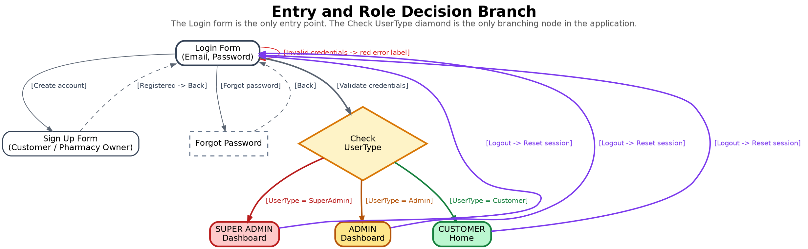

*Entry and role decision branch. The Login form is the only entry point, and the Check UserType diamond is the single branching node in the application.*

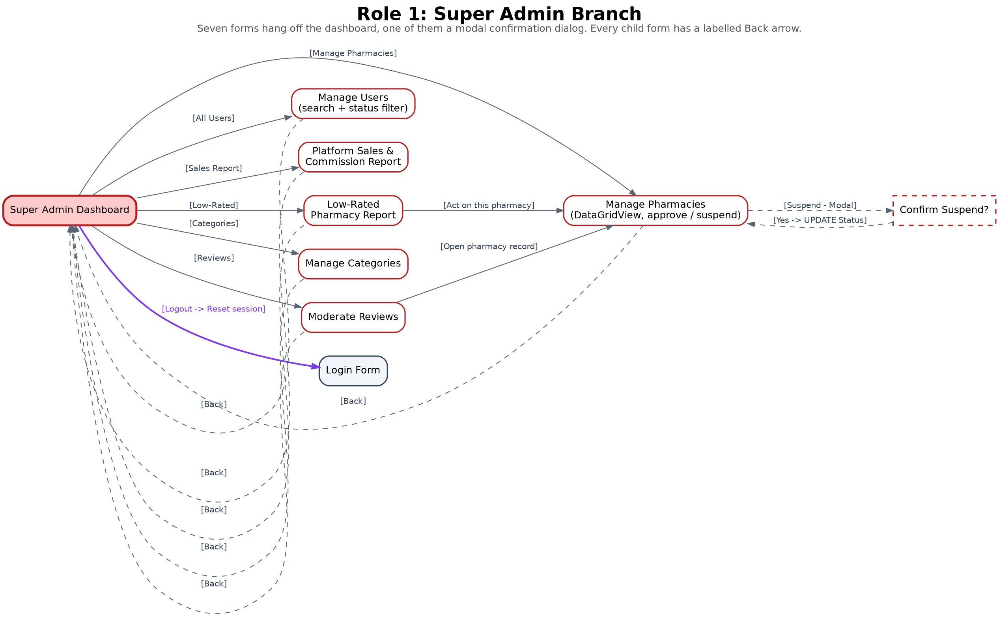

*Super Admin branch. Seven forms hang off the dashboard, each with a labelled Back arrow. Confirm Suspend is a modal dialog.*

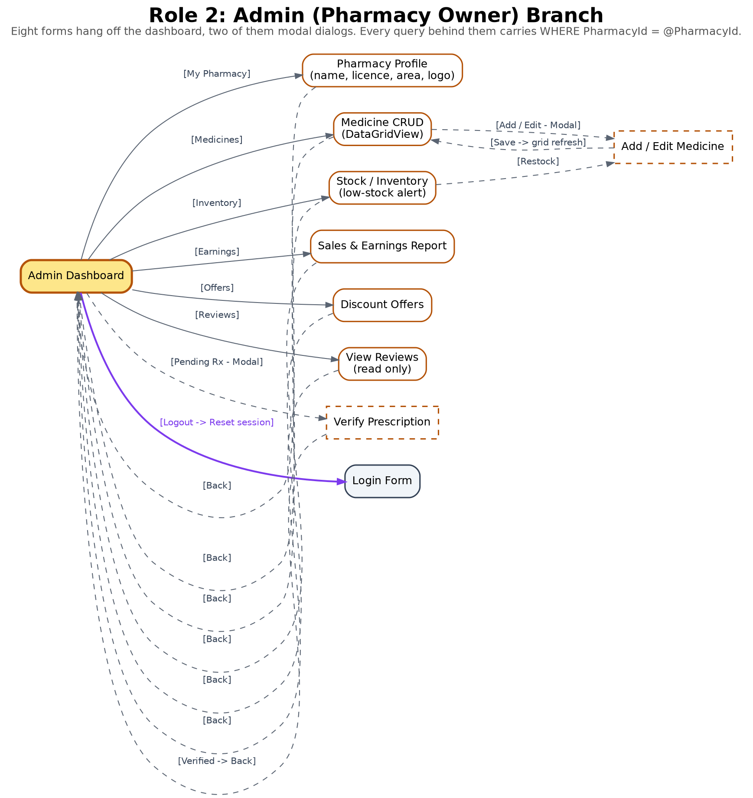

*Admin branch. Eight forms plus two modal dialogs. Every query behind these forms carries `WHERE PharmacyId = @PharmacyId`.*

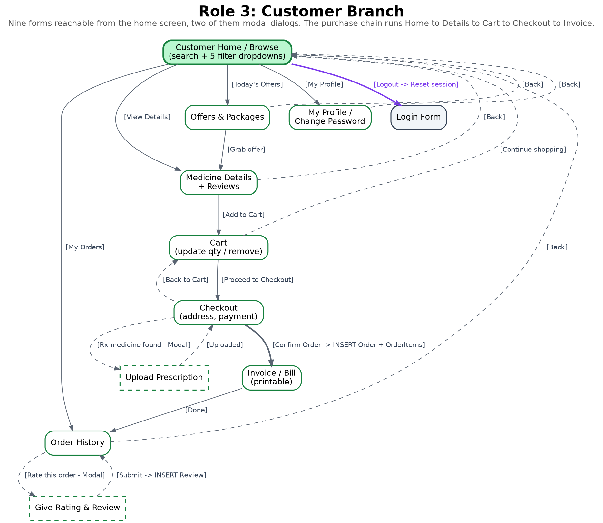

*Customer branch. Ten forms plus two modal dialogs, with the purchase chain running Home to Details to Cart to Checkout to Invoice.*

---

## 5. Database Design

### 5.1 SQL Schema Diagram

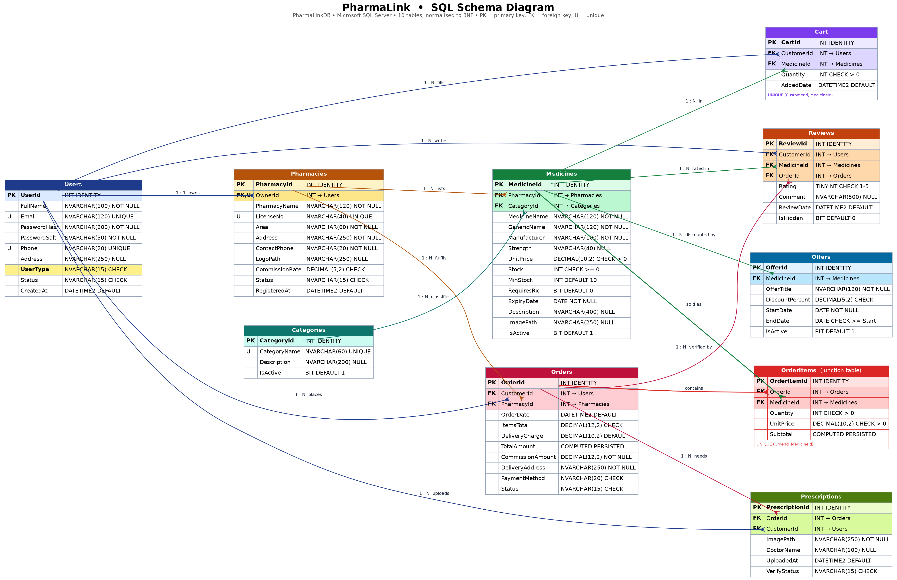

The database is named **PharmaLinkDB** and contains ten tables. `Users` holds all three roles, `OrderItems` is the mandatory junction table between `Orders` and `Medicines`, and `Categories` exists so that a category name is stored exactly once.

### 5.2 Table Descriptions

#### Users

Stores all three roles in one table. The UserType column is what the login query reads to decide which dashboard opens.

| Column | Data Type | Constraint | Description |
|--------|-----------|------------|-------------|
| `UserId` | INT IDENTITY(1,1) | PRIMARY KEY | Surrogate key for every person on the platform |
| `FullName` | NVARCHAR(100) | NOT NULL | Display name shown on dashboards, invoices and reviews |
| `Email` | NVARCHAR(120) | UNIQUE, NOT NULL, CHECK | Login identifier; CHECK enforces a basic address pattern |
| `PasswordHash` | NVARCHAR(200) | NOT NULL | Salted SHA-256 hash; plain text is never stored |
| `PasswordSalt` | NVARCHAR(50) | NOT NULL | Per user random salt used when hashing |
| `Phone` | NVARCHAR(20) | UNIQUE, NOT NULL | Contact number, unique so one number is one account |
| `Address` | NVARCHAR(250) | NULL | Default delivery address, pre filled at checkout |
| `UserType` | NVARCHAR(15) | NOT NULL, CHECK | 'SuperAdmin', 'Admin' or 'Customer'; drives dashboard routing |
| `Status` | NVARCHAR(15) | NOT NULL, DEFAULT, CHECK | 'Pending', 'Active' or 'Suspended'; only Active users can log in |
| `CreatedAt` | DATETIME2(0) | NOT NULL, DEFAULT | Registration timestamp, shown as Member Since |

#### Categories

Master list of medicine categories maintained by the Super Admin. Kept separate so a category name is stored once.

| Column | Data Type | Constraint | Description |
|--------|-----------|------------|-------------|
| `CategoryId` | INT IDENTITY(1,1) | PRIMARY KEY | Surrogate key |
| `CategoryName` | NVARCHAR(60) | UNIQUE, NOT NULL | For example Antibiotic, Painkiller, Diabetes Care |
| `Description` | NVARCHAR(200) | NULL | Short explanation shown as a tooltip in the filter dropdown |
| `IsActive` | BIT | NOT NULL, DEFAULT 1 | Soft delete flag; a referenced category is deactivated, never removed |

#### Pharmacies

One row per Admin. OwnerId is UNIQUE, which enforces the rule that one pharmacy owner owns exactly one pharmacy.

| Column | Data Type | Constraint | Description |
|--------|-----------|------------|-------------|
| `PharmacyId` | INT IDENTITY(1,1) | PRIMARY KEY | Surrogate key; every Admin side query filters on this value |
| `OwnerId` | INT | FOREIGN KEY, UNIQUE | References Users(UserId); UNIQUE gives the one to one relationship |
| `PharmacyName` | NVARCHAR(120) | NOT NULL | Trading name, for example Mitford Pharma |
| `LicenseNo` | NVARCHAR(40) | UNIQUE, NOT NULL | DGDA drug licence number checked by the Super Admin |
| `Area` | NVARCHAR(60) | NOT NULL | Locality used by the customer's Area filter |
| `Address` | NVARCHAR(250) | NOT NULL | Full postal address printed on the invoice |
| `ContactPhone` | NVARCHAR(20) | NOT NULL | Shop landline or mobile |
| `LogoPath` | NVARCHAR(250) | NULL | Relative path to the shop logo image |
| `CommissionRate` | DECIMAL(5,2) | NOT NULL, CHECK 0-30 | Platform commission percentage for this pharmacy |
| `Status` | NVARCHAR(15) | NOT NULL, CHECK | 'Pending', 'Approved' or 'Suspended' |
| `RegisteredAt` | DATETIME2(0) | NOT NULL, DEFAULT | When the registration was submitted |

#### Medicines

The products for sale. Two pharmacies selling the same brand are two separate rows with their own price and stock.

| Column | Data Type | Constraint | Description |
|--------|-----------|------------|-------------|
| `MedicineId` | INT IDENTITY(1,1) | PRIMARY KEY | Surrogate key |
| `PharmacyId` | INT | FOREIGN KEY, NOT NULL | References Pharmacies(PharmacyId); the isolation column |
| `CategoryId` | INT | FOREIGN KEY, NOT NULL | References Categories(CategoryId) |
| `MedicineName` | NVARCHAR(120) | NOT NULL | Brand name, for example Napa |
| `GenericName` | NVARCHAR(120) | NOT NULL | Molecule name, for example Paracetamol; searchable |
| `Manufacturer` | NVARCHAR(100) | NOT NULL | For example Beximco, Square, Renata |
| `Strength` | NVARCHAR(40) | NULL | For example 500mg or 100ml |
| `UnitPrice` | DECIMAL(10,2) | NOT NULL, CHECK > 0 | Selling price per unit in taka |
| `Stock` | INT | NOT NULL, CHECK >= 0 | Units currently on the shelf |
| `MinStock` | INT | NOT NULL, DEFAULT 10 | Threshold that triggers the low stock alert |
| `RequiresRx` | BIT | NOT NULL, DEFAULT 0 | 1 means a prescription image is required at checkout |
| `ExpiryDate` | DATE | NOT NULL | Expiry date; expired stock is not offered to customers |
| `Description` | NVARCHAR(400) | NULL | Short description shown on the details form |
| `ImagePath` | NVARCHAR(250) | NULL | Relative path to the product image |
| `IsActive` | BIT | NOT NULL, DEFAULT 1 | Set to 0 when the pharmacy is suspended or the item is delisted |

#### Cart

The customer's live basket. One line per medicine, enforced by a UNIQUE constraint so adding twice updates the quantity.

| Column | Data Type | Constraint | Description |
|--------|-----------|------------|-------------|
| `CartId` | INT IDENTITY(1,1) | PRIMARY KEY | Surrogate key |
| `CustomerId` | INT | FOREIGN KEY, NOT NULL | References Users(UserId) |
| `MedicineId` | INT | FOREIGN KEY, NOT NULL | References Medicines(MedicineId) |
| `Quantity` | INT | NOT NULL, CHECK > 0 | Units the customer intends to buy |
| `AddedDate` | DATETIME2(0) | NOT NULL, DEFAULT | Used to expire abandoned baskets |
| `(composite)` | UNIQUE | (CustomerId, MedicineId) | Stops duplicate lines for the same medicine |

#### Orders

One row per completed checkout. A cart that spans two pharmacies becomes two orders. ItemsTotal and CommissionAmount are a snapshot of what was actually paid on the day, so a later price change cannot rewrite an old invoice.

| Column | Data Type | Constraint | Description |
|--------|-----------|------------|-------------|
| `OrderId` | INT IDENTITY(1,1) | PRIMARY KEY | Invoice number shown to the customer |
| `CustomerId` | INT | FOREIGN KEY, NOT NULL | References Users(UserId) |
| `PharmacyId` | INT | FOREIGN KEY, NOT NULL | References Pharmacies(PharmacyId); one order per pharmacy |
| `OrderDate` | DATETIME2(0) | NOT NULL, DEFAULT | Timestamp used by every date range report |
| `ItemsTotal` | DECIMAL(12,2) | NOT NULL, CHECK >= 0 | Sum of the order's line items after any offer discount |
| `DeliveryCharge` | DECIMAL(10,2) | NOT NULL, DEFAULT 60 | Charged to the customer; the platform takes no commission on it |
| `TotalAmount` | COMPUTED PERSISTED | AS (ItemsTotal + DeliveryCharge) | The bill total, so it can never disagree with its parts |
| `CommissionAmount` | DECIMAL(12,2) | NOT NULL | ItemsTotal times the pharmacy's CommissionRate, frozen at checkout |
| `DeliveryAddress` | NVARCHAR(250) | NOT NULL | Copied from the profile but editable per order |
| `PaymentMethod` | NVARCHAR(20) | NOT NULL, CHECK | 'CashOnDelivery', 'bKash', 'Nagad' or 'Card' |
| `Status` | NVARCHAR(15) | NOT NULL, CHECK | 'Placed', 'Confirmed', 'Delivered' or 'Cancelled' |

#### OrderItems

The mandatory junction table. It resolves the many to many relationship between Orders and Medicines.

| Column | Data Type | Constraint | Description |
|--------|-----------|------------|-------------|
| `OrderItemId` | INT IDENTITY(1,1) | PRIMARY KEY | Surrogate key |
| `OrderId` | INT | FOREIGN KEY, ON DELETE CASCADE | References Orders(OrderId) |
| `MedicineId` | INT | FOREIGN KEY, NOT NULL | References Medicines(MedicineId) |
| `Quantity` | INT | NOT NULL, CHECK > 0 | Units of this medicine in this order |
| `UnitPrice` | DECIMAL(10,2) | NOT NULL, CHECK > 0 | Price on the day of purchase, not today's price |
| `Subtotal` | COMPUTED PERSISTED | AS (Quantity * UnitPrice) | Derived by SQL Server, so it can never drift |
| `(composite)` | UNIQUE | (OrderId, MedicineId) | One line per medicine per order |

#### Reviews

Ratings and comments. OrderId is carried so the application can prove the reviewer actually bought the item.

| Column | Data Type | Constraint | Description |
|--------|-----------|------------|-------------|
| `ReviewId` | INT IDENTITY(1,1) | PRIMARY KEY | Surrogate key |
| `CustomerId` | INT | FOREIGN KEY, NOT NULL | References Users(UserId) |
| `MedicineId` | INT | FOREIGN KEY, NOT NULL | References Medicines(MedicineId) |
| `OrderId` | INT | FOREIGN KEY, NOT NULL | References Orders(OrderId); makes the review verified |
| `Rating` | TINYINT | NOT NULL, CHECK BETWEEN 1 AND 5 | Star rating |
| `Comment` | NVARCHAR(500) | NULL | Written feedback |
| `ReviewDate` | DATETIME2(0) | NOT NULL, DEFAULT | When the review was written |
| `IsHidden` | BIT | NOT NULL, DEFAULT 0 | Set to 1 by Super Admin moderation instead of deleting |
| `(composite)` | UNIQUE | (CustomerId, MedicineId, OrderId) | One review per medicine per order |

#### Offers

Percentage discount on one medicine, valid between two dates, created by the pharmacy owner.

| Column | Data Type | Constraint | Description |
|--------|-----------|------------|-------------|
| `OfferId` | INT IDENTITY(1,1) | PRIMARY KEY | Surrogate key |
| `MedicineId` | INT | FOREIGN KEY, NOT NULL | References Medicines(MedicineId) |
| `OfferTitle` | NVARCHAR(120) | NOT NULL | Shown on the customer's Offers screen |
| `DiscountPercent` | DECIMAL(5,2) | NOT NULL, CHECK 0 < x <= 70 | Discount percentage |
| `StartDate` | DATE | NOT NULL | First day the offer applies |
| `EndDate` | DATE | NOT NULL, CHECK >= Start | Last day the offer applies |
| `IsActive` | BIT | NOT NULL, DEFAULT 1 | Lets the owner pause an offer without deleting it |

#### Prescriptions

Uploaded prescription image for an order containing a medicine whose RequiresRx flag is set.

| Column | Data Type | Constraint | Description |
|--------|-----------|------------|-------------|
| `PrescriptionId` | INT IDENTITY(1,1) | PRIMARY KEY | Surrogate key |
| `OrderId` | INT | FOREIGN KEY, ON DELETE CASCADE | References Orders(OrderId) |
| `CustomerId` | INT | FOREIGN KEY, NOT NULL | References Users(UserId) |
| `ImagePath` | NVARCHAR(250) | NOT NULL | Relative path to the uploaded JPG or PNG |
| `DoctorName` | NVARCHAR(100) | NULL | Prescribing doctor as typed by the customer |
| `UploadedAt` | DATETIME2(0) | NOT NULL, DEFAULT | Upload timestamp |
| `VerifyStatus` | NVARCHAR(15) | NOT NULL, CHECK | 'Pending', 'Approved' or 'Rejected' by the pharmacy |

### 5.3 ER Diagram (bonus)

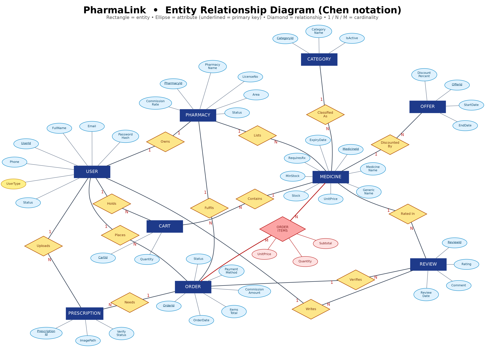

The ER diagram is drawn in Chen notation: rectangles are entities, ellipses are attributes with the primary key underlined, diamonds are relationships and the 1, N and M labels on the connecting lines give the cardinality. The only many to many relationship in the model is ORDER to MEDICINE, drawn in red, and it is resolved by the ORDER ITEMS associative entity that carries its own attributes: quantity, unit price and subtotal.

### 5.4 Normalisation (3NF Justification)

The schema is in third normal form, and each step can be justified against the actual tables.

**First normal form.** Every column holds a single atomic value and there are no repeating groups. The obvious temptation in a marketplace is to store the medicines of an order as a comma separated list inside Orders, which would break 1NF immediately. Instead an order's line items live in the OrderItems table, one row per medicine, with the quantity and the unit price on that row. There is no multi valued column anywhere in the database.

**Second normal form.** Every non key column depends on the whole primary key, not part of it. The only table with a natural composite candidate key is OrderItems, whose real identity is (OrderId, MedicineId). Quantity and UnitPrice both depend on that full pair: quantity is meaningless without knowing which medicine in which order, and the unit price is the price of that medicine at the moment of that order. A surrogate OrderItemId is used as the primary key for convenience in C#, and the natural key is protected by a UNIQUE constraint on (OrderId, MedicineId), so the 2NF argument still holds.

**Third normal form.** No non key column depends on another non key column. This is where the Categories table earns its place. If the category name were stored as a text column inside Medicines, then CategoryName would depend on nothing but itself repeated across rows, and renaming 'Painkiller' to 'Analgesic' would mean an update on every affected medicine with the risk of half the rows being missed. Instead Medicines stores CategoryId as a foreign key and the name lives once in Categories. The same reasoning applies to Pharmacies: the shop name, licence number and area describe the pharmacy, not the medicine, so they are not repeated on every medicine row. Users likewise holds the customer's name, phone and address once, and Orders refers to the customer by CustomerId rather than copying the name into the order.

**Two deliberate exceptions, and why they are not violations.** Orders.TotalAmount and Orders.CommissionAmount can both be recomputed from OrderItems, and OrderItems.UnitPrice can be read from Medicines. These are stored anyway because they are historical snapshots rather than derived facts. An invoice must show what the customer actually paid on the day of purchase, so if a pharmacy raises the price of a medicine next week, last week's invoice and last week's commission must not change. OrderItems.Subtotal is different again: it is declared as a computed PERSISTED column, so SQL Server derives it from Quantity and UnitPrice and it can never drift out of step with them.

---

## 6. SQL Queries

The complete runnable script is in [`database/schema.sql`](database/schema.sql). It creates the database, all ten tables with their constraints, inserts sample data of at least three rows per table including one Super Admin, four pharmacy owners and four customers, and then runs the feature queries below. `JOIN`, `GROUP BY`, `HAVING` and the aggregate functions `SUM`, `AVG` and `COUNT` are all used.

### 6.1 Login and role routing

*Form:* `LoginForm`

```sql
DECLARE @Email NVARCHAR(120) = 'rahim@gmail.com', @PasswordHash NVARCHAR(200) = 'HASH_Cust@123';

SELECT  u.UserId, u.FullName, u.UserType, u.Status,
        p.PharmacyId                       -- NULL for SuperAdmin and Customer
FROM    Users u
        LEFT JOIN Pharmacies p ON p.OwnerId = u.UserId
WHERE   u.Email        = @Email
  AND   u.PasswordHash = @PasswordHash
  AND   u.Status       = 'Active';
```

This one query does the whole of authentication. It returns the user id, name, user type and, through a LEFT JOIN on Pharmacies, the PharmacyId when the user happens to be a pharmacy owner. That PharmacyId is stored in the session and every later Admin query filters on it. Because the WHERE clause also demands Status = 'Active', a Pending or Suspended account is refused by the same statement that checks the password, with no second round trip.

### 6.2 Filter medicines by price range

*Form:* `CustomerHomeForm`

```sql
DECLARE @MinPrice DECIMAL(10,2) = 0, @MaxPrice DECIMAL(10,2) = 50;

SELECT  m.MedicineId, m.MedicineName, m.Strength, m.UnitPrice, m.Stock, ph.PharmacyName
FROM    Medicines m
        INNER JOIN Pharmacies ph ON ph.PharmacyId = m.PharmacyId
WHERE   m.IsActive  = 1
  AND   ph.Status   = 'Approved'
  AND   m.UnitPrice BETWEEN @MinPrice AND @MaxPrice
ORDER BY m.UnitPrice ASC;
```

The price range ComboBox supplies @MinPrice and @MaxPrice. The join to Pharmacies is not decoration: it lets the WHERE clause exclude any pharmacy that is not Approved, so a suspended shop's stock disappears from the catalogue without a single row being deleted.

### 6.3 Filter by category and availability

*Form:* `CustomerHomeForm`

```sql
DECLARE @CategoryId INT = 2;   -- Painkiller

SELECT  m.MedicineId, m.MedicineName, c.CategoryName, m.UnitPrice, m.Stock,
        ph.PharmacyName, ph.Area
FROM    Medicines m
        INNER JOIN Categories  c  ON c.CategoryId  = m.CategoryId
        INNER JOIN Pharmacies  ph ON ph.PharmacyId = m.PharmacyId
WHERE   c.CategoryId = @CategoryId
  AND   m.Stock      > 0
  AND   m.IsActive   = 1
  AND   ph.Status    = 'Approved'
ORDER BY ph.Area, m.MedicineName;
```

Two filters combined in one statement. Stock > 0 backs the In stock only dropdown, and the second join brings in the category name so the grid can show it without a second query. Results are ordered by area so that customers see nearby pharmacies grouped together.

### 6.4 Keyword search

*Form:* `shared search box on every dashboard`

```sql
DECLARE @Keyword NVARCHAR(60) = 'paracetamol';

SELECT  m.MedicineId, m.MedicineName, m.GenericName, m.Manufacturer,
        m.UnitPrice, m.Stock, ph.PharmacyName
FROM    Medicines m
        INNER JOIN Pharmacies ph ON ph.PharmacyId = m.PharmacyId
WHERE   m.IsActive = 1
  AND  (m.MedicineName LIKE '%' + @Keyword + '%'
    OR  m.GenericName  LIKE '%' + @Keyword + '%'
    OR  m.Manufacturer LIKE '%' + @Keyword + '%')
ORDER BY m.MedicineName;
```

The search deliberately covers three columns. A customer who types 'paracetamol' does not know that the brand is called Napa, and a customer who types 'Square' wants everything that manufacturer makes. Searching the generic name is what makes the catalogue useful to someone holding a doctor's chit rather than a box.

### 6.5 Cart: add, remove and view with total

*Form:* `MedicineDetailsForm and CartForm`

```sql
DECLARE @CustomerId INT = 6, @MedicineId INT = 1, @Quantity INT = 30;

-- add an item (insert a new line, or increase the quantity if the line already exists)
MERGE Cart AS target
USING (SELECT @CustomerId AS CustomerId, @MedicineId AS MedicineId, @Quantity AS Quantity) AS source
    ON  target.CustomerId = source.CustomerId
    AND target.MedicineId = source.MedicineId
WHEN MATCHED THEN
    UPDATE SET target.Quantity = target.Quantity + source.Quantity
WHEN NOT MATCHED THEN
    INSERT (CustomerId, MedicineId, Quantity)
    VALUES (source.CustomerId, source.MedicineId, source.Quantity);

-- change the quantity of one line, or remove it
UPDATE Cart SET Quantity = @Quantity WHERE CustomerId = @CustomerId AND MedicineId = @MedicineId;
DELETE FROM Cart            WHERE CustomerId = @CustomerId AND MedicineId = @MedicineId;

-- view the basket, with today's offer applied to each line
SELECT  ph.PharmacyName,
        m.MedicineName,
        ct.Quantity,
        m.UnitPrice                                   AS ListPrice,
        ISNULL(d.Pct, 0)                              AS DiscountPercent,
        CAST(m.UnitPrice * (1 - ISNULL(d.Pct,0)/100.0) AS DECIMAL(10,2)) AS PriceYouPay,
        CAST(ct.Quantity * m.UnitPrice * (1 - ISNULL(d.Pct,0)/100.0) AS DECIMAL(12,2)) AS LineTotal
FROM    Cart ct
        INNER JOIN Medicines  m  ON m.MedicineId  = ct.MedicineId
        INNER JOIN Pharmacies ph ON ph.PharmacyId = m.PharmacyId
        OUTER APPLY (SELECT MAX(ofr.DiscountPercent) AS Pct
                     FROM   Offers ofr
                     WHERE  ofr.MedicineId = m.MedicineId
                       AND  ofr.IsActive   = 1
                       AND  CAST(GETDATE() AS DATE) BETWEEN ofr.StartDate AND ofr.EndDate) d
WHERE   ct.CustomerId = @CustomerId
ORDER BY ph.PharmacyName, m.MedicineName;

-- basket summary per pharmacy: this is how many orders checkout will create
SELECT  ph.PharmacyId,
        ph.PharmacyName,
        COUNT(*)                                                                        AS Lines,
        CAST(SUM(ct.Quantity * m.UnitPrice) AS DECIMAL(12,2))                           AS BeforeDiscount,
        CAST(SUM(ct.Quantity * m.UnitPrice * (1 - ISNULL(d.Pct,0)/100.0)) AS DECIMAL(12,2)) AS ItemsTotal,
        60.00                                                                            AS DeliveryCharge
FROM    Cart ct
        INNER JOIN Medicines  m  ON m.MedicineId  = ct.MedicineId
        INNER JOIN Pharmacies ph ON ph.PharmacyId = m.PharmacyId
        OUTER APPLY (SELECT MAX(ofr.DiscountPercent) AS Pct
                     FROM   Offers ofr
                     WHERE  ofr.MedicineId = m.MedicineId AND ofr.IsActive = 1
                       AND  CAST(GETDATE() AS DATE) BETWEEN ofr.StartDate AND ofr.EndDate) d
WHERE   ct.CustomerId = @CustomerId
GROUP BY ph.PharmacyId, ph.PharmacyName
ORDER BY ph.PharmacyName;
```

MERGE handles the add case in one statement: if the customer already has that medicine in the basket the quantity is increased, otherwise a new line is inserted. That is what keeps the UNIQUE constraint on (CustomerId, MedicineId) from ever being violated. The view query is offer aware: OUTER APPLY finds the best discount running today for each medicine, so the price the customer sees in the cart is the same price the checkout will charge. The second SELECT groups the basket by pharmacy, because a cart that spans two pharmacies becomes two separate orders at checkout and each one carries its own delivery charge.

### 6.6 Checkout: order, line items and stock in one transaction

*Form:* `CheckoutForm`

```sql
DECLARE @CustomerId      INT           = 6;      -- from the session
DECLARE @PharmacyId      INT           = 1;      -- checkout runs once per pharmacy in the cart
DECLARE @DeliveryCharge  DECIMAL(10,2) = 60.00;  -- Tk 60 per pharmacy
DECLARE @DeliveryAddress NVARCHAR(250) = 'House 7, Road 3, Mirpur 10, Dhaka';
DECLARE @PaymentMethod   NVARCHAR(20)  = 'bKash';
DECLARE @NewOrderId INT, @Total DECIMAL(12,2), @CommRate DECIMAL(5,2);

BEGIN TRANSACTION;

    -- 1. what this pharmacy's slice of the basket costs, with today's offers applied
    SELECT @Total = CAST(SUM(ct.Quantity * m.UnitPrice * (1 - ISNULL(d.Pct,0)/100.0)) AS DECIMAL(12,2))
    FROM   Cart ct
           INNER JOIN Medicines m ON m.MedicineId = ct.MedicineId
           OUTER APPLY (SELECT MAX(ofr.DiscountPercent) AS Pct FROM Offers ofr
                        WHERE ofr.MedicineId = m.MedicineId AND ofr.IsActive = 1
                          AND CAST(GETDATE() AS DATE) BETWEEN ofr.StartDate AND ofr.EndDate) d
    WHERE  ct.CustomerId = @CustomerId AND m.PharmacyId = @PharmacyId;

    SELECT @CommRate = CommissionRate FROM Pharmacies WHERE PharmacyId = @PharmacyId;

    -- 2. the order header, with the commission frozen at today's rate
    INSERT INTO Orders (CustomerId, PharmacyId, ItemsTotal, DeliveryCharge, CommissionAmount,
                        DeliveryAddress, PaymentMethod, Status)
    VALUES (@CustomerId, @PharmacyId, @Total, @DeliveryCharge,
            CAST(@Total * @CommRate / 100.0 AS DECIMAL(12,2)),
            @DeliveryAddress, @PaymentMethod, 'Placed');

    SET @NewOrderId = SCOPE_IDENTITY();

    -- 3. one line per cart row, at the discounted price the customer actually saw
    INSERT INTO OrderItems (OrderId, MedicineId, Quantity, UnitPrice)
    SELECT @NewOrderId, ct.MedicineId, ct.Quantity,
           CAST(m.UnitPrice * (1 - ISNULL(d.Pct,0)/100.0) AS DECIMAL(10,2))
    FROM   Cart ct
           INNER JOIN Medicines m ON m.MedicineId = ct.MedicineId
           OUTER APPLY (SELECT MAX(ofr.DiscountPercent) AS Pct FROM Offers ofr
                        WHERE ofr.MedicineId = m.MedicineId AND ofr.IsActive = 1
                          AND CAST(GETDATE() AS DATE) BETWEEN ofr.StartDate AND ofr.EndDate) d
    WHERE  ct.CustomerId = @CustomerId AND m.PharmacyId = @PharmacyId;

    -- 4. take the stock off the shelf
    UPDATE m SET m.Stock = m.Stock - ct.Quantity
    FROM   Medicines m INNER JOIN Cart ct ON ct.MedicineId = m.MedicineId
    WHERE  ct.CustomerId = @CustomerId AND m.PharmacyId = @PharmacyId;

    -- 5. clear only this pharmacy's lines; the rest of the basket becomes the next order
    DELETE ct
    FROM   Cart ct INNER JOIN Medicines m ON m.MedicineId = ct.MedicineId
    WHERE  ct.CustomerId = @CustomerId AND m.PharmacyId = @PharmacyId;

COMMIT TRANSACTION;
```

This is the most important query group in the system. Note the @PharmacyId filter on all four cart statements: the customer's basket may hold medicines from two pharmacies, and each pharmacy becomes its own order with its own delivery charge, so checkout runs this batch once per pharmacy in the cart. Five things must then happen together: the order header is written, one line is written per cart row at the price the customer was shown, the stock of every medicine is reduced, that pharmacy's cart lines are cleared, and the commission is frozen on the order row. If any one of them failed on its own the database would be left with an order that has no items, or stock that was sold twice. Wrapping them in a single transaction is what makes the checkout safe.

### 6.7 Pharmacy earnings (JOIN + GROUP BY + SUM)

*Form:* `SuperAdminSalesReportForm and AdminEarningsForm`

```sql
SELECT  ph.PharmacyId, ph.PharmacyName, ph.Area,
        COUNT(DISTINCT o.OrderId) AS TotalOrders,
        SUM(oi.Quantity)          AS UnitsSold,
        SUM(oi.Subtotal)          AS GrossSales,
        CAST(SUM(oi.Subtotal) * ph.CommissionRate / 100.0 AS DECIMAL(12,2)) AS PlatformCommission,
        CAST(AVG(oi.UnitPrice) AS DECIMAL(10,2))                            AS AverageItemPrice
FROM    Pharmacies ph
        INNER JOIN Orders     o  ON o.PharmacyId = ph.PharmacyId
        INNER JOIN OrderItems oi ON oi.OrderId   = o.OrderId
WHERE   o.Status <> 'Cancelled'
GROUP BY ph.PharmacyId, ph.PharmacyName, ph.Area, ph.CommissionRate
ORDER BY GrossSales DESC;
```

The Super Admin runs this as it stands to see every pharmacy. The pharmacy owner runs the same query with an added WHERE ph.PharmacyId = @PharmacyId and sees only his own row, which is the clearest possible demonstration of data isolation: one query, two role scopes. Commission is recomputed from the pharmacy rate rather than summed from Orders, because the join to OrderItems multiplies the order rows and would inflate a plain SUM of the header column.

### 6.8 Low stock alert

*Form:* `AdminInventoryForm`

```sql
DECLARE @PharmacyId INT = 3;   -- Lazz Care Pharmacy, from the session

SELECT  m.MedicineId, m.MedicineName, m.Strength, c.CategoryName,
        m.Stock, m.MinStock, (m.MinStock - m.Stock) AS ShortfallUnits
FROM    Medicines m
        INNER JOIN Categories c ON c.CategoryId = m.CategoryId
WHERE   m.PharmacyId = @PharmacyId          -- data isolation: own pharmacy only
  AND   m.Stock      < m.MinStock
  AND   m.IsActive   = 1
ORDER BY ShortfallUnits DESC;
```

Comparing two columns of the same row is what makes this alert useful. A fixed threshold would be wrong, because ten boxes of a glucometer is plenty while ten strips of Napa is nothing. The shortfall column tells the owner how many units to order. The WHERE clause carries the PharmacyId, so the alert can never leak another shop's inventory.

### 6.9 Reviews for one medicine (JOIN)

*Form:* `MedicineDetailsForm`

```sql
DECLARE @MedicineId INT = 1;   -- Napa 500mg

SELECT  r.ReviewId, u.FullName AS ReviewerName, r.Rating, r.Comment, r.ReviewDate
FROM    Reviews r
        INNER JOIN Users     u ON u.UserId     = r.CustomerId
        INNER JOIN Medicines m ON m.MedicineId = r.MedicineId
WHERE   r.MedicineId = @MedicineId
  AND   r.IsHidden   = 0
ORDER BY r.ReviewDate DESC;
```

Reviews store only a CustomerId, so the join to Users is what turns a number into the reviewer's name on screen. Hidden reviews are excluded here rather than deleted at source, which means Super Admin moderation takes effect immediately on every customer screen while the row survives for audit.

### 6.10 Pharmacies rated below 2.5 (JOIN + GROUP BY + HAVING + AVG)

*Form:* `SuperAdminLowRatedShopsForm`

```sql
SELECT  ph.PharmacyId, ph.PharmacyName, ph.Area,
        u.FullName AS OwnerName, u.Phone AS OwnerPhone,
        COUNT(r.ReviewId) AS TotalReviews,
        CAST(AVG(CAST(r.Rating AS DECIMAL(4,2))) AS DECIMAL(4,2)) AS AverageRating
FROM    Pharmacies ph
        INNER JOIN Users     u ON u.UserId     = ph.OwnerId
        INNER JOIN Medicines m ON m.PharmacyId = ph.PharmacyId
        INNER JOIN Reviews   r ON r.MedicineId = m.MedicineId
WHERE   r.IsHidden = 0
GROUP BY ph.PharmacyId, ph.PharmacyName, ph.Area, u.FullName, u.Phone
HAVING  AVG(CAST(r.Rating AS DECIMAL(4,2))) < 2.5
   AND  COUNT(r.ReviewId) >= 2
ORDER BY AverageRating ASC;
```

Ratings sit on medicines, not on pharmacies, so the average has to be built by joining three tables and grouping back up to the pharmacy. HAVING is the right clause rather than WHERE because the condition is on the aggregate itself. The second HAVING condition, COUNT(ReviewId) >= 2, is a deliberate fairness rule: one angry customer should not be enough to put a shop on the suspension list.

### 6.11 Super Admin: approve and suspend a pharmacy owner

*Form:* `SuperAdminManageShopsForm`

```sql
DECLARE @PharmacyId INT = 4, @OwnerId INT = 5;   -- New Life Pharmacy, still Pending

-- approve a pending pharmacy owner
UPDATE Pharmacies SET Status = 'Approved'  WHERE PharmacyId = @PharmacyId;
UPDATE Users      SET Status = 'Active'    WHERE UserId     = @OwnerId;

-- suspend an owner and hide their medicines from customers
UPDATE Pharmacies SET Status   = 'Suspended' WHERE PharmacyId = @PharmacyId;
UPDATE Users      SET Status   = 'Suspended' WHERE UserId     = @OwnerId;
UPDATE Medicines  SET IsActive = 0           WHERE PharmacyId = @PharmacyId;
```

Approval flips two rows, because the pharmacy record and the login account are separate concerns. Suspension flips three: the pharmacy, the account and every medicine that pharmacy lists. Nothing is deleted anywhere, so the invoices customers already hold and the sales figures in last month's report stay exactly as they were.

### 6.12 Active offers today with the discounted price

*Form:* `CustomerOffersForm`

```sql
SELECT  o.OfferId, o.OfferTitle, m.MedicineName, m.Strength, ph.PharmacyName,
        m.UnitPrice AS OriginalPrice, o.DiscountPercent,
        CAST(m.UnitPrice * (1 - o.DiscountPercent / 100.0) AS DECIMAL(10,2)) AS DiscountedPrice,
        o.EndDate
FROM    Offers o
        INNER JOIN Medicines  m  ON m.MedicineId  = o.MedicineId
        INNER JOIN Pharmacies ph ON ph.PharmacyId = m.PharmacyId
WHERE   o.IsActive = 1
  AND   CAST(GETDATE() AS DATE) BETWEEN o.StartDate AND o.EndDate
  AND   m.Stock    > 0
  AND   ph.Status  = 'Approved'
ORDER BY o.DiscountPercent DESC;
```

The discounted price is calculated in the query rather than in C#, so the same number appears on the offers screen, the details screen and the cart without three chances to disagree. Filtering on the date range inside the query means an expired offer can never be shown by mistake, whatever the form does.

### 6.13 Revenue by area (JOIN + GROUP BY + HAVING + COUNT + SUM)

*Form:* `SuperAdminDashboard tiles`

```sql
SELECT  ph.Area,
        COUNT(DISTINCT ph.PharmacyId) AS PharmaciesInArea,
        COUNT(DISTINCT o.OrderId)     AS Orders,
        SUM(o.TotalAmount)            AS Revenue,
        SUM(o.CommissionAmount)       AS CommissionEarned
FROM    Pharmacies ph
        INNER JOIN Orders o ON o.PharmacyId = ph.PharmacyId
WHERE   o.Status = 'Delivered'
GROUP BY ph.Area
HAVING  SUM(o.TotalAmount) > 100
ORDER BY Revenue DESC;
```

An extra reporting query that answers a question the Super Admin actually asks: which parts of the city are worth expanding into. It groups delivered orders by pharmacy area and uses HAVING to drop areas that have not yet crossed a meaningful revenue figure.

### 6.14 Sign up: register a customer or a pharmacy owner

*Form:* `SignUpForm`

```sql
DECLARE @NewUserId INT;

-- a customer signs up: usable straight away
INSERT INTO Users (FullName, Email, PasswordHash, PasswordSalt, Phone, Address, UserType, Status)
VALUES (N'Tanjila Akter', 'tanjila@gmail.com', 'HASH_Cust@123', 'SA1', '01811000010',
        N'Mohammadpur, Dhaka', 'Customer', 'Active');

-- a pharmacy owner signs up: the account and the pharmacy both start Pending
INSERT INTO Users (FullName, Email, PasswordHash, PasswordSalt, Phone, Address, UserType, Status)
VALUES (N'Imran Hossain', 'popular@pharmalink.com.bd', 'HASH_Pharma@123', 'SA2', '01711000011',
        N'Panthapath, Dhaka', 'Admin', 'Pending');
SET @NewUserId = SCOPE_IDENTITY();

INSERT INTO Pharmacies (OwnerId, PharmacyName, LicenseNo, Area, Address, ContactPhone, Status)
VALUES (@NewUserId, N'Popular Pharmacy', 'DGDA-DH-10099', N'Panthapath',
        N'House 9, Panthapath, Dhaka 1205', '02955000099', 'Pending');
```

A customer is created Active and can use the platform immediately. A pharmacy owner is created Pending together with a Pending pharmacy row, and neither becomes usable until the Super Admin approves it, which is the workflow behind query 11. The UNIQUE constraints on Email and Phone are what actually stop a duplicate account, so the form checks first only to give a friendly message.

### 6.15 Medicine CRUD for the logged in pharmacy

*Form:* `AdminMedicineForm and the Add / Edit Medicine dialog`

```sql
DECLARE @PharmacyId INT = 1, @MedicineId INT = 3;

-- CREATE
INSERT INTO Medicines (PharmacyId, CategoryId, MedicineName, GenericName, Manufacturer,
                       Strength, UnitPrice, Stock, MinStock, RequiresRx, ExpiryDate, Description)
VALUES (@PharmacyId, 7, N'Seclo', N'Omeprazole', N'Square Pharmaceuticals',
        N'20mg', 7.00, 120, 30, 1, '2027-12-31', N'Proton pump inhibitor for acidity and ulcer');

-- READ (the DataGridView)
SELECT  m.MedicineId, m.MedicineName, m.GenericName, c.CategoryName, m.Manufacturer,
        m.Strength, m.UnitPrice, m.Stock, m.MinStock, m.RequiresRx, m.ExpiryDate
FROM    Medicines m INNER JOIN Categories c ON c.CategoryId = m.CategoryId
WHERE   m.PharmacyId = @PharmacyId AND m.IsActive = 1
ORDER BY m.MedicineName;

-- UPDATE
UPDATE Medicines
SET    UnitPrice = 9.00, Stock = 320, MinStock = 60, ExpiryDate = '2028-06-30'
WHERE  MedicineId = @MedicineId AND PharmacyId = @PharmacyId;

-- DELETE (soft, so OrderItems rows stay valid)
UPDATE Medicines SET IsActive = 0
WHERE  MedicineId = @MedicineId AND PharmacyId = @PharmacyId;

-- create and pause a discount offer on one of my own medicines  (requirement 14)
INSERT INTO Offers (MedicineId, OfferTitle, DiscountPercent, StartDate, EndDate)
SELECT m.MedicineId, N'Winter Cold Pack - 12% off', 12.00, '2026-11-01', '2026-11-30'
FROM   Medicines m
WHERE  m.MedicineId = @MedicineId AND m.PharmacyId = @PharmacyId;  -- own medicines only

UPDATE ofr SET ofr.IsActive = 0
FROM   Offers ofr INNER JOIN Medicines m ON m.MedicineId = ofr.MedicineId
WHERE  ofr.OfferId = 4 AND m.PharmacyId = @PharmacyId;
```

The statements behind the Add, Update, Delete and Create Offer buttons. Every one of them carries PharmacyId, so an Admin cannot create a medicine under someone else's shop, and cannot update or delete a row that is not his. Delete is a soft delete: setting IsActive to 0 keeps the foreign keys from OrderItems intact, so old invoices still resolve.

### 6.16 Super Admin: user list, category CRUD and commission rate

*Form:* `SuperAdminManageUsersForm, ManageCategoriesForm`

```sql
DECLARE @Keyword NVARCHAR(60) = '', @Status NVARCHAR(15) = '', @CategoryId INT = 6, @PharmacyId INT = 1;

-- all users, with the pharmacy name for owners  (requirement 4)
SELECT  u.UserId, u.FullName, u.Email, u.Phone, u.UserType, u.Status,
        ph.PharmacyName, u.CreatedAt
FROM    Users u
        LEFT JOIN Pharmacies ph ON ph.OwnerId = u.UserId
WHERE  (@Keyword = '' OR u.FullName LIKE '%' + @Keyword + '%' OR u.Email LIKE '%' + @Keyword + '%')
  AND  (@Status  = '' OR u.Status = @Status)
ORDER BY u.UserType, u.FullName;

-- category master list  (requirement 7)
INSERT INTO Categories (CategoryName, Description) VALUES (N'Skin Care', N'Dermatological creams and ointments');
UPDATE Categories SET Description = N'Analgesic, antipyretic and anti-inflammatory medicines' WHERE CategoryId = 2;
UPDATE Categories SET IsActive = 0 WHERE CategoryId = @CategoryId;   -- deactivate, never delete

-- set one pharmacy's commission rate  (requirement 9)
UPDATE Pharmacies SET CommissionRate = 9.50 WHERE PharmacyId = @PharmacyId;

-- the moderation queue, and hiding an abusive review  (requirement 8)
SELECT  r.ReviewId, u.FullName AS Reviewer, m.MedicineName, ph.PharmacyName,
        r.Rating, r.Comment, r.ReviewDate, r.OrderId
FROM    Reviews r
        INNER JOIN Users      u  ON u.UserId      = r.CustomerId
        INNER JOIN Medicines  m  ON m.MedicineId  = r.MedicineId
        INNER JOIN Pharmacies ph ON ph.PharmacyId = m.PharmacyId
WHERE   r.Rating <= 2 AND r.IsHidden = 0
ORDER BY r.ReviewDate DESC;

UPDATE Reviews SET IsHidden = 1 WHERE ReviewId = 5;   -- hidden, never deleted
```

The small administrative statements that the requirements list but that have no report of their own. The user list joins Users to Pharmacies so that a pharmacy owner's shop name appears beside his name, and it accepts a keyword and a status from the search box and the Status ComboBox. Categories are deactivated rather than deleted, because Medicines rows point at them.

### 6.17 Customer: place a review, and read the order history

*Form:* `GiveRatingForm and OrderHistoryForm`

```sql
DECLARE @CustomerId INT = 6, @MedicineId INT = 3, @OrderId INT = 1002, @Rating TINYINT = 4;

-- write a review, but only for a delivered order that actually contained the medicine
INSERT INTO Reviews (CustomerId, MedicineId, OrderId, Rating, Comment)
SELECT @CustomerId, @MedicineId, @OrderId, @Rating, N'Sealed pack, delivered on time.'
WHERE EXISTS (SELECT 1
              FROM   OrderItems oi INNER JOIN Orders o ON o.OrderId = oi.OrderId
              WHERE  oi.OrderId    = @OrderId
                AND  oi.MedicineId = @MedicineId
                AND  o.CustomerId  = @CustomerId
                AND  o.Status      = 'Delivered');

-- order history with item count and the reviewable flag  (requirement 27)
SELECT  o.OrderId, o.OrderDate, ph.PharmacyName,
        COUNT(oi.OrderItemId)   AS Items,
        o.ItemsTotal, o.DeliveryCharge, o.TotalAmount,
        o.PaymentMethod, o.Status,
        CASE WHEN o.Status = 'Delivered'
              AND EXISTS (SELECT 1 FROM OrderItems x
                          WHERE x.OrderId = o.OrderId
                            AND NOT EXISTS (SELECT 1 FROM Reviews r
                                            WHERE r.OrderId = o.OrderId AND r.MedicineId = x.MedicineId))
             THEN 1 ELSE 0 END  AS CanReview
FROM    Orders o
        INNER JOIN Pharmacies ph ON ph.PharmacyId = o.PharmacyId
        INNER JOIN OrderItems oi ON oi.OrderId    = o.OrderId
WHERE   o.CustomerId = @CustomerId
GROUP BY o.OrderId, o.OrderDate, ph.PharmacyName, o.ItemsTotal, o.DeliveryCharge,
         o.TotalAmount, o.PaymentMethod, o.Status
ORDER BY o.OrderDate DESC;
```

The review INSERT is guarded twice. The WHERE EXISTS clause proves the customer really bought that medicine on that order, and the UNIQUE constraint on (CustomerId, MedicineId, OrderId) stops the same purchase being rated twice, so a duplicate attempt fails at the database even if the form is bypassed. The order history query below it is what fills the customer's Orders grid, including the invoice total from the computed TotalAmount column.

### 6.18 Profile update, password change and prescription verification

*Form:* `MyProfileForm and the Verify Prescription dialog`

```sql
DECLARE @UserId INT = 6, @OldHash NVARCHAR(200) = 'HASH_Cust@123', @NewHash NVARCHAR(200) = 'HASH_Cust@456';
DECLARE @PrescriptionId INT = 3, @OrderId INT = 1005, @PharmacyId INT = 3;

-- update own profile  (requirements 17, 30)
UPDATE Users
SET    FullName = N'Rahim Uddin', Phone = '01811000006', Address = N'House 7, Road 3, Mirpur 10, Dhaka'
WHERE  UserId = @UserId;

-- change own password: succeeds only if the current password hash matches
UPDATE Users
SET    PasswordHash = @NewHash, PasswordSalt = 'NEWSALT'
WHERE  UserId = @UserId AND PasswordHash = @OldHash;

-- the customer uploads a prescription during checkout  (requirement 26)
INSERT INTO Prescriptions (OrderId, CustomerId, ImagePath, DoctorName)
VALUES (1005, 9, 'rx/2026/08/rx-1005b.jpg', N'Dr. Anisur Rahman, MBBS');

-- the pharmacy's prescription queue  (requirement 16)
SELECT  p.PrescriptionId, p.OrderId, u.FullName AS Customer, p.DoctorName, p.ImagePath, p.VerifyStatus
FROM    Prescriptions p
        INNER JOIN Orders o ON o.OrderId    = p.OrderId
        INNER JOIN Users  u ON u.UserId     = p.CustomerId
WHERE   o.PharmacyId = @PharmacyId AND p.VerifyStatus = 'Pending';

UPDATE Prescriptions SET VerifyStatus = 'Approved' WHERE PrescriptionId = @PrescriptionId;

-- an order cannot be confirmed while a prescription on it is still Pending
UPDATE Orders SET Status = 'Confirmed'
WHERE  OrderId = @OrderId
  AND  NOT EXISTS (SELECT 1 FROM Prescriptions p
                   WHERE p.OrderId = @OrderId AND p.VerifyStatus <> 'Approved');
```

The password change verifies the current hash inside the same UPDATE, so a wrong current password simply updates no rows and the form reports failure without ever having read the stored hash into memory. The prescription statements are the Admin side of the same story: an order that still has a Pending prescription cannot be moved to Confirmed, which the last statement enforces with a NOT EXISTS clause rather than trusting the form.

---

## 7. User Interface Design

18 form designs, all sharing one colour scheme, one font and one button style. Every form has a visible title, a breadcrumb and either a Back button or a Logout button, so there are no dead ends. Data lists use a DataGridView rather than a ListBox, and every filter control is a ComboBox rather than a free text box. Validation and error states are shown in forms 1, 2, 7 and 13.

### 7.1 Login Form

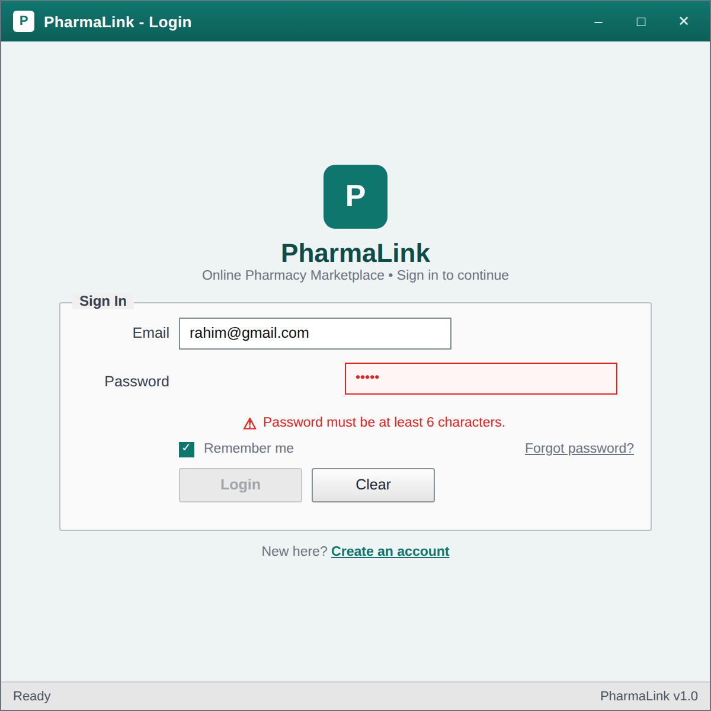

The single entry point for all three roles. The screenshot shows the validation state: the password box is outlined in red, the error label reads 'Password must be at least 6 characters' and the Login button is disabled until the rule is satisfied.

### 7.2 Sign Up / Registration Form


Registration for both customers and pharmacy owners, chosen through the Register as dropdown. Two validation states are visible at once: an invalid email format and a password confirmation mismatch. A pharmacy owner registering here is stored with Status 'Pending', together with a Pending Pharmacies row, and neither becomes usable until the Super Admin approves it.

### 7.3 Super Admin Dashboard


The platform hub. Four summary tiles, a grid of pharmacies waiting for approval, and the low rated pharmacy panel that comes straight from the HAVING AVG(Rating) < 2.5 query. The left menu is the entry point to every other Super Admin form.

### 7.4 Super Admin: Manage Pharmacies


A DataGridView of every pharmacy with search and two ComboBox filters. Approve, Suspend and Delete act on the selected row only. The note under the grid explains that suspension updates three tables and deletes nothing.

### 7.5 Super Admin: Platform Sales and Commission Report


Date range, area and status filters feed the JOIN plus GROUP BY earnings query. Tiles show gross sales, commission, units sold and average order value; the grid breaks the same figures down per pharmacy with a bold total row.

### 7.6 Admin: Medicine CRUD


The pharmacy owner's inventory grid with Add, Update, Delete and Create Offer. The hint under the buttons states the isolation rule that every query on this form carries WHERE PharmacyId = 1, so another pharmacy's rows can never appear.

### 7.7 Admin: Add Medicine (modal dialog with validation)

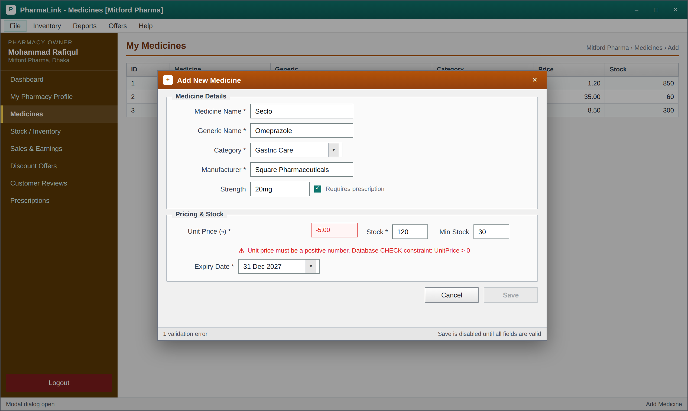

The modal drawn with a dashed border in the navigation diagram. Unit Price is negative, so the field is outlined in red, the error names the CHECK constraint that would reject the value at the database as well, and Save is greyed out.

### 7.8 Admin: Stock and Inventory Dashboard

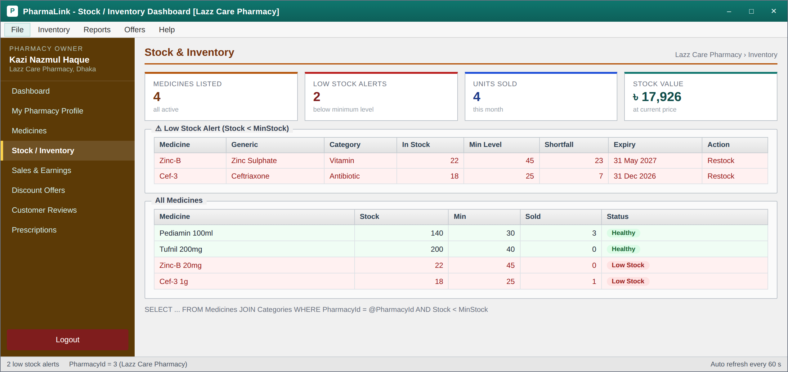

The low stock alert panel lists medicines where Stock is below MinStock, tinted red, with the shortfall in units. Below it, the full inventory grid marks each medicine as Healthy or Low Stock.

### 7.9 Admin: Sales and Earnings Report

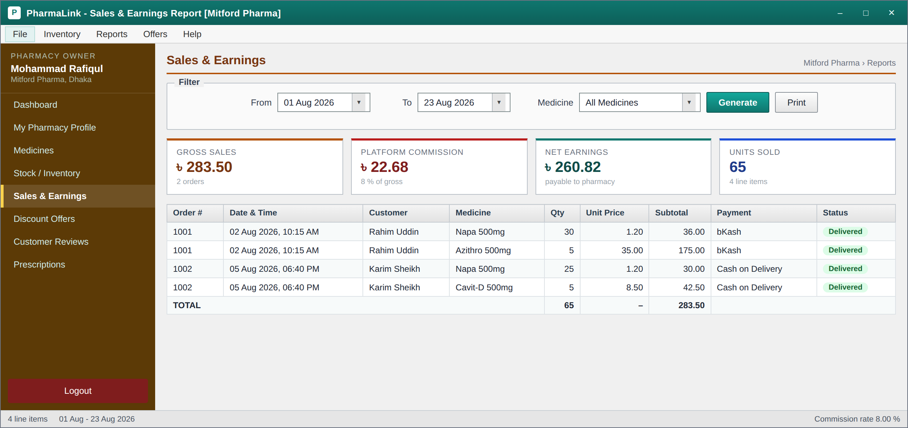

Who bought what, when, at what unit price. Tiles separate gross sales, platform commission and net earnings so the owner can see exactly what PharmaLink deducts. The commission figure is read from the frozen Orders.CommissionAmount column.

### 7.10 Customer: Home and Browse

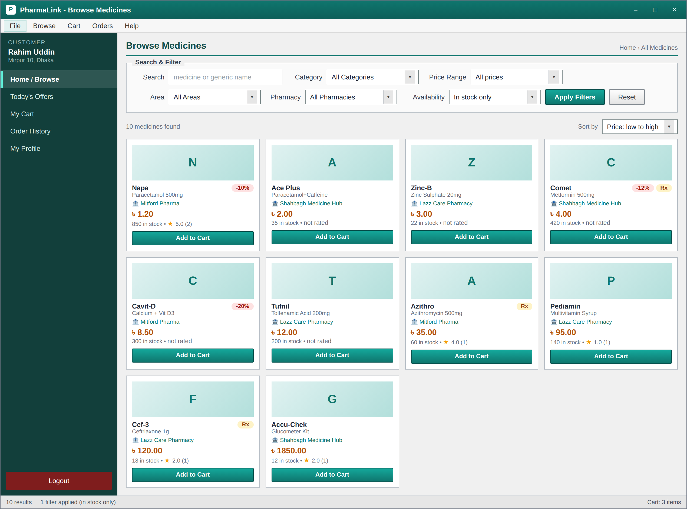

The catalogue across every approved pharmacy, with a keyword search box and five ComboBox filters: category, price range, area, pharmacy and availability. Prescription only items are badged Rx and discounted items carry a percentage badge.

### 7.11 Customer: Medicine Details and Reviews

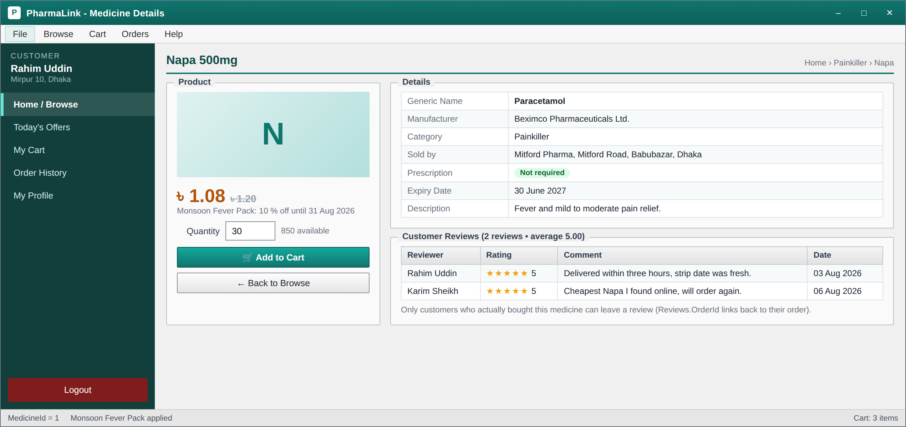

Manufacturer, strength, expiry date, selling pharmacy and prescription requirement, with the discounted price shown beside the struck through original. Underneath, the reviews grid comes from the join of Reviews and Users.

### 7.12 Customer: Cart

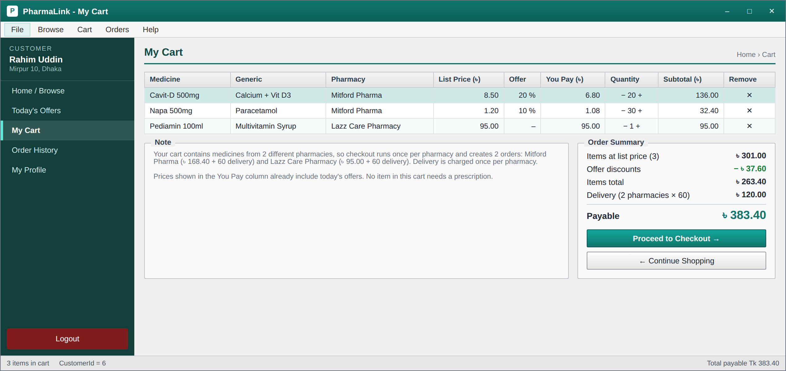

One row per medicine with a quantity spinner and a subtotal, plus a summary panel showing items total, discount, delivery charge and the payable amount. The note explains that a cart spanning two pharmacies produces one order per pharmacy.

### 7.13 Customer: Checkout


The Mitford Pharma half of the basket, headed Order 1 of 2. Delivery details and payment method on the left, the order review on the right with the offer discounts already applied. The bKash number is incomplete, so it is outlined in red and Confirm Order is disabled. The hint lists the five statements the Confirm button runs inside one transaction, all of them scoped to this pharmacy.

### 7.14 Customer: Invoice / Bill


The printable bill generated after checkout, carrying the order number, both addresses, the pharmacy licence number, the line items and the grand total. The footer notes that the platform commission is deducted from the pharmacy, not the customer.

### 7.15 Customer: Order History

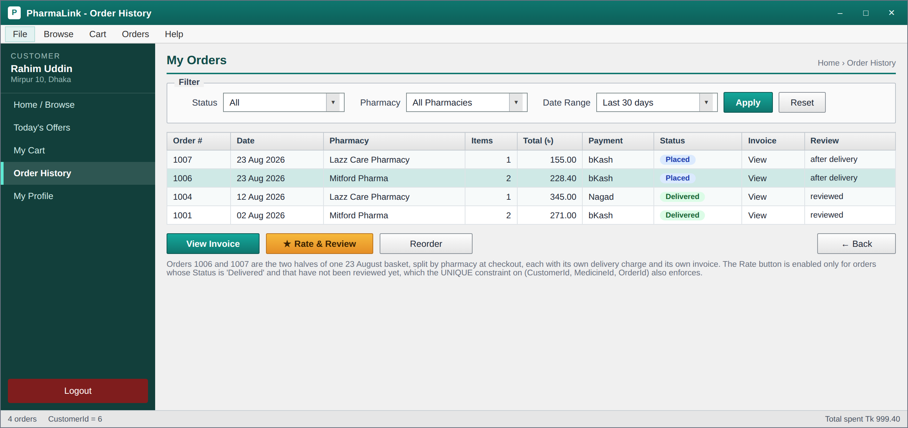

Past orders with status pills, an invoice link and a Rate and Review action. Orders 1006 and 1007 are the two halves of one 23 August basket, split by pharmacy at checkout. The hint explains that the Rate button is enabled only for delivered orders that have not already been reviewed, which the UNIQUE constraint on Reviews also enforces.

### 7.16 Customer: Offers and Packages


The three offers running on 23 August 2026, with the discounted price already calculated by the query so the same number appears here, on the details screen and in the cart. Offers whose EndDate has passed, such as the July glucometer offer in the sample data, are filtered out at the database rather than in the form.

### 7.17 Customer: My Profile and Change Password

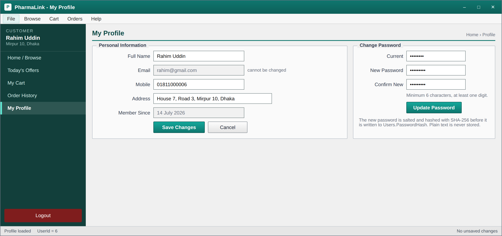

Profile editing on the left and password change on the right. Email is read only because it is the login identifier. The note records that the new password is salted and hashed with SHA-256 before it reaches the database.

### 7.18 Super Admin: Moderate Reviews

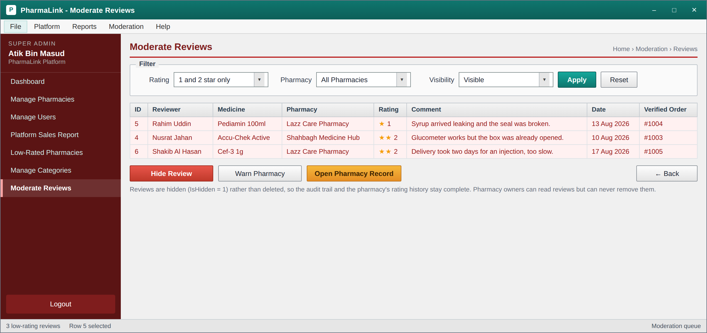

The moderation queue, filtered by default to one and two star reviews. Each row carries the order number that verifies the purchase, so a review always traces back to a real delivered order. Hide Review sets IsHidden to 1 rather than deleting, so the pharmacy's rating history stays complete and the decision can be reversed.

---

## 8. Technology Stack

| Area | Choice |
|------|--------|
| Language | C# 10 |
| UI framework | Windows Forms (.NET 8 SDK style project) |
| IDE | Visual Studio 2022 Community |
| Database engine | Microsoft SQL Server Express 2019 or newer |
| Data access | System.Data.SqlClient with parameterised queries only, no string concatenation |
| Password security | Salted SHA-256 hashing, plain text never stored |
| Architecture | Three layers: Models, Repositories and Services, with Forms and UserControls on top |
| Diagram tools | Graphviz for the navigation, schema and ER diagrams |
| Mockup tool | Hand built HTML and CSS styled to match Windows Forms controls, rendered to PNG with headless Chromium |
| Version control | Git and GitHub, one public repository per group |

---

## 9. How to Run (planned)

1. Install Visual Studio 2022 Community with the **.NET desktop development** workload, and SQL
   Server Express 2019 or newer with SQL Server Management Studio.
2. Clone the repository: `git clone https://github.com/<user>/PharmaLink-Pharmacy-Marketplace.git`
3. Open SQL Server Management Studio, open `database/schema.sql` and execute the whole script. It
   creates the `PharmaLinkDB` database, all ten tables and the sample data in one run.
4. Open `PharmaLink.sln` in Visual Studio and set `ServerName` in `PharmaLink/Utils/DbConnection.cs`
   to your own SQL Server instance name, for example `.\SQLEXPRESS`.
5. Press F5. The Login form opens. Sign in with one of the seeded accounts below.

| Role | Email | Password |
|------|-------|----------|
| Super Admin | superadmin@pharmalink.com.bd | Admin@123 |
| Admin (Mitford Pharma) | mitford@pharmalink.com.bd | Pharma@123 |
| Admin (Shahbagh Medicine Hub) | shahbagh@pharmalink.com.bd | Pharma@123 |
| Admin (Lazz Care Pharmacy) | lazz@pharmalink.com.bd | Pharma@123 |
| Customer (Rahim, has a cart and past orders) | rahim@gmail.com | Cust@123 |
| Customer (Nusrat) | nusrat@gmail.com | Cust@123 |

> The `PasswordHash` column in `schema.sql` holds the readable placeholder `HASH_<password>` so that
> the demo passwords are visible in the script. The application hashes the typed password with a
> salted SHA-256 before comparing, and rewrites these placeholder rows with real hashes on first run.
> A plain text password is never stored.

---

## 10. Future Work

This submission is the design phase. The coding phase will implement the blueprint in the order
below, and the challenges we already expect are noted against each item.

1. **Login and role routing first.** The single decision node in the navigation diagram becomes a
   `switch` on `UserType` inside `LoginForm`. The challenge is session state: we need one static
   `Session` class holding the user id, user type and PharmacyId so that every later query can
   filter by it, and it has to be cleared properly on logout.
2. **Repository layer before any form.** Each table gets a repository class with parameterised
   queries. Getting this right early is what stops SQL injection and stops query strings being
   scattered through button click handlers.
3. **Admin data isolation.** Every Admin side query must carry `WHERE PharmacyId = Session.PharmacyId`.
   The expected difficulty is remembering it consistently, so the plan is to pass the PharmacyId
   into the repository constructor rather than into each method, which makes it impossible to forget.
4. **Checkout as a single transaction.** Inserting the order, inserting the line items, decrementing
   stock and clearing the cart must all succeed or all fail. Concurrent orders on the last unit of
   a medicine are the real risk here, and we plan to re-check stock inside the transaction before
   committing.
5. **DataGridView formatting.** Low stock rows in red and delivered orders in green need the
   `CellFormatting` event rather than manual painting, and refreshing the grid without losing the
   selected row takes care.
6. **Reporting queries.** The commission and low rated pharmacy reports use JOIN with GROUP BY and
   HAVING. Testing them against the seeded data before wiring them to a form will save time.

Beyond the course requirements, the features we would like to add are a delivery rider role with
live order tracking, an SMS notification when an order status changes, a refill reminder for
patients on long term medication, a bKash payment gateway integration instead of a manually entered
transaction id, and a Bangla language toggle for the customer screens.

---

## 11. Report

[Download the full PDF report](docs/Project_Report.pdf) &nbsp;&middot;&nbsp; [editable Word version](docs/Project_Report.docx)

### Repository structure

```
PharmaLink-Pharmacy-Marketplace/
|
|-- README.md                              <- this file (D1, D2 and all images)
|
|-- docs/
|   |-- Project_Report.pdf                 <- D7 formal report with AIUB cover page
|   |-- diagrams/
|   |   |-- ui-navigation-diagram.png      <- D3, the complete diagram
|   |   |-- nav-entry.png                  <- D3, entry and role decision, enlarged
|   |   |-- nav-superadmin.png             <- D3, Super Admin branch, enlarged
|   |   |-- nav-admin.png                  <- D3, Admin branch, enlarged
|   |   |-- nav-customer.png               <- D3, Customer branch, enlarged
|   |   |-- sql-schema-diagram.png         <- D4
|   |   |-- er-diagram.png                 <- bonus
|   |-- screenshots/
|       |-- 01-login.png                   <- D6 (18 images)
|       |-- 02-signup.png
|       |-- ...
|       |-- 18-superadmin-moderate-reviews.png
|
|-- database/
    |-- schema.sql                         <- D5
```

---

## 12. Work Distribution

The table below records what each member actually produced. Every member has commits in the repository under their own GitHub account, which can be checked against the Contributors graph, and every member can explain the whole design and not only their own section.

| Member | ID | What they contributed |
|--------|----|------------------------|
| Nafiul Islam | 21-45717-3 | Case study, functional requirements, user stories, README assembly |
| Md Arafat Rahman | 22-47910-2 | Database design, normalization, SQL schema diagram, schema.sql, feature queries |
| Muhtasim Mahin | 23-53789-3 | UI navigation diagram, ER diagram, form designs (Super Admin and Admin) |
| Shohidur Raza Sujon | 22-49449-3 | Form designs (Customer), report compilation, proofreading |

---

